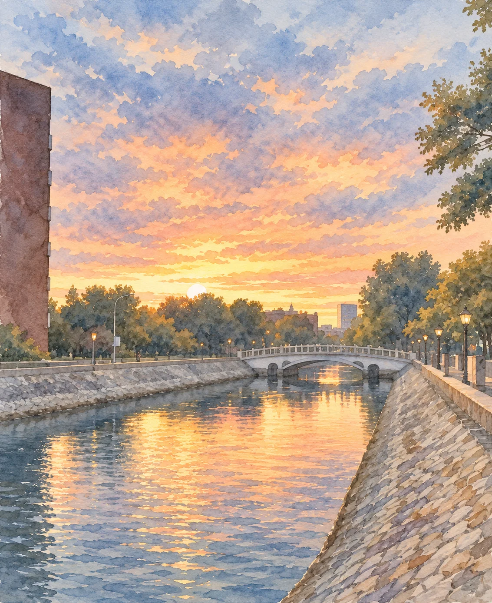

2025年7月27日晨，录取结果在手机上加载出来，天津两个字终于落定，十八岁的少年如愿出了省。那时，总觉得远方应当比眼前辽阔，只要走出去，日子便会有另一种展开的方式。

九月，带着这样的确信，我把沱江留在身后，奔向海河。

初到北方，一切都透露着一股新鲜感。迎新歌会上第一次近距离接触明星，因为各种学生工作而结识了许多同学，自由得需要自己安排的课余时间，都让我觉得，漫长的中学生活终于翻了页。连秋天也格外分明：绿意从叶缘悄悄退去，金黄与深红渐次染上枝头，风一过，便有叶子打着旋儿落在脚边。我常因此驻足，仿佛第一次看清季节怎样交接。在成都的记忆里，夏冬之间总是过得很匆忙；可天津的秋却格外大方，热忱地向我展示每一天的变化。

那时读“我言秋日胜春朝”，只觉得刘禹锡说得真好。

然而，新鲜感总有褪去之时，于是，那横亘一千五百公里的离别之苦，就此漫上心头，无从消磨。

最先想家的就是胃。吃惯了四川的麻辣鲜香，再面对食堂里咸甜口的饭菜，总觉得嘴巴里上少了些什么。站在窗口前，常是看了许久也不知吃什么，偶尔见着一道放了辣椒的菜，满怀期待地尝一口，却仍寻不到记忆里那股花椒的麻、辣油的香。不合口的饭，为了饱腹，只能一口一口往下咽，一个学期过去，竟瘦了十斤。

于是格外想念家里的灶台：豆瓣酱炒出红油，回锅肉在热锅里煸得微微卷边，再撒进一把蒜苗儿，锅铲还没翻动几下，浓香便顺着门缝钻了出来。香味把馋虫勾进厨房，眼巴巴地盯着锅里，就等出锅往桌上端菜时能先捞一个来吃。也想念那碗红油抄手，薄薄的皮裹着满满的肉，臊子和花椒面随着筷子的拨动在红油里与抄手充分碰撞，一入口，香气便在嘴里爆开。最后就算吃到额头冒汗、嘴唇发麻，还要舍不得地把最后一点馅料捞干净。那时候，厨房里总有人问：“够不够？锅头还有。”

以前只顾着吃，从来没有认真记过这些味道。可到了异乡，连油锅与锅铲的碰撞声、菜端上桌时冒起的热气都想得清清楚楚。

离家以后，才知道胃也有记忆，记得一座城怎样养大一个人，也记得那座城里谁总怕你没吃饱。

日子一长，北方的风也渐渐换了脾气。初来时吹动树叶的轻快，入冬前竟能变得这样锋利————那几乎不是风，而是想要一下子把地面上的一切都扫除的灾患，剥夺了人出门的一切欲望。皮肤也迟迟适应不了干燥，痘痘接二连三地冒出来，常常上一颗还未消下去，新的又红了起来。我把衣领拉高，低头走过校园，先前舍不得错过的落叶，这时只觉得满地萧索。

同一阵秋风，心里有期待时吹来风景，心里有牵挂时吹来距离。

这份距离还藏在日历里，一次离家，下一次归乡便要等四五个月。身边的老师同学都很好，彼此客气，可似乎正是这份客气让彼此的心都蒙上了一层保护色，很难对对方开放。一起学习、工作和说笑时，感到的快乐的确十分真切，只是热闹散场想说的话常常找不到合适的人听。

海河边的灯一盏盏亮起来，水面很美，我却总想起沱江。我把成都的饭香、乡音和旧日子都放进那条熟悉的河里，站在另一条河边反复回望。来时只想着终于走远了，可真走远以后却又开始问自己：若远方意味着这样的孤独，我为什么要来？

如今，站在又一个秋天里回望，我开始慢慢认出自己的矛盾：我向往远方带来的自由，却也盼望它保留故乡的安稳；我想走进全新的生活，又希望不必经历成为陌生人的过程。我想念家，也想念那个知道为何忙碌、为何奋斗和如何去做的自己。于是我一边埋怨生活失去了方向，一边又等着它重新给我一张像高考那样清晰的时间表。

可是河流不会停在我认识它的那一天，生活也是。若始终拿从前的模样衡量眼前，便容易把一切变化都看作失去，忘了生活也在悄悄给予。我既然珍重来处，也该允许此后的岁月长成未曾设想的模样。

又来到了海河边漫步，我变得愿意多看一会儿眼前的水。那些灯光与晚霞也曾让初来的我驻足，只是后来每一次看见，都急着拿它们与故乡相比。如今想来，沱江的亲切是源于许多年慢慢的积淀；初识海河，我也该接受一段生活在成为归属之前，先有些陌生。

沱江留着我的来处，海河正收下我的此刻。

我仍会想家，也仍有迷茫，只是再读“我言秋日胜春朝”时开始觉得，那份豁达应当容得下离别，也容得下不舍。金黄和深红的树叶在秋风中又渐渐离开枝头，然而它们并没有消失，只是回到了另一种秩序里。秋日里的天空显得异常高远，尽管我还看不清很远的将来，却愿意先把眼前的日子过得更加认真一些。

又有风从海河上吹来，我拢了拢衣领继续往前走。

沱江的水声留在心里，海河的晚风吹在身上，新的故事，会在这阵秋风中慢慢展开…………
